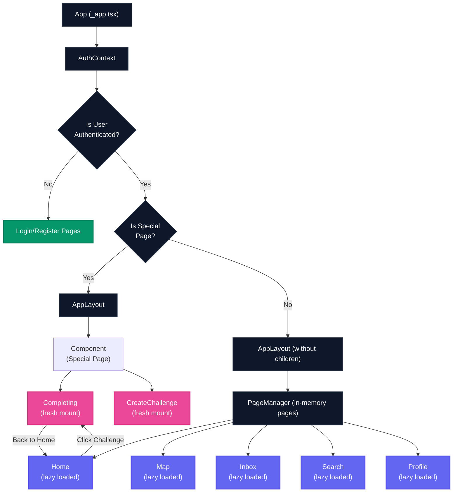

# Nocena Hybrid Navigation Architecture

## Overview

Nocena implements a hybrid navigation architecture that combines persistent page components with traditional page routing. This approach optimizes both performance and user experience by:

1. Keeping main navigation pages in memory for instant switching
2. Using traditional routing for workflow-based pages that benefit from fresh state

## Architecture Diagram



## Key Components

### 1. PageManager

The `PageManager` component (located at `src/components/PageManager.tsx`) manages the core navigation pages:

- Lazily loads pages when first visited
- Keeps pages in memory for instant navigation
- Uses display toggling to show only the active page
- Progressively enhances by loading other pages in the background

```tsx
// Core implementation concept
const PageManager = () => {
  // Load and manage core navigation pages
  // Keep pages in DOM but toggle visibility
  return (
    <div>
      <div style={{ display: isHomePage ? 'block' : 'none' }}>
        <Suspense fallback={<HomeLoading />}>
          <HomePage />
        </Suspense>
      </div>
      {/* Other pages... */}
    </div>
  );
};
```

### 2. AppLayout

`AppLayout` component has been modified to:

- Handle shallow routing for navigation between main pages
- Use PageManager for core pages instead of directly rendering children
- Properly handle logout to ensure clean state

### 3. Special Pages

Pages like `/completing` and `/createchallenge` remain separate from the PageManager:

- They mount fresh each time they're accessed
- They unmount completely when navigating away
- They're rendered directly in AppLayout when needed

## Navigation Flow

1. **Core Navigation Pages (Blue)**:

   - Home, Map, Inbox, Search, Profile
   - Once loaded, they stay in memory
   - Switching between them is nearly instantaneous
   - State is preserved between navigations

2. **Special Workflow Pages (Pink)**:
   - Completing, CreateChallenge
   - Fresh mount each time they're accessed
   - Clean state for each new workflow
   - Traditional page transitions

## Benefits

- **Faster Navigation**: Instant switching between main app sections
- **Preserved State**: User's position, input, and scroll location maintained
- **Better UX**: No flash of loading content when switching main tabs
- **Optimized Resource Usage**: Only functional workflows get fresh state
- **Clean Architecture**: Clear separation between persistent and fresh-state pages

## Implementation Details

The implementation is spread across several files:

1. `src/components/PageManager.tsx` - New component managing core page loading
2. `src/components/layout/AppLayout.tsx` - Updated to use PageManager
3. `src/pages/_app.tsx` - Modified to handle the hybrid routing approach

## Adding New Pages

When adding new pages to the app:

- **Core Navigation Pages**: Add to PageManager if they're part of the main navigation
- **Special Pages**: Add to the `isSpecialPage` check in `_app.tsx` if they need fresh state each time

```tsx
// In _app.tsx
const isSpecialPage = [
  '/login',
  '/register',
  '/completing',
  '/createchallenge',
  // Add new special pages here
].includes(router.pathname);
```

## Performance Considerations

- The first page load remains as fast as before
- Subsequent navigation between core pages becomes nearly instant
- Memory usage increases slightly as pages are kept loaded
- Consider using the React DevTools Profiler to monitor performance

## Troubleshooting

Common issues and solutions:

1. **Page not showing when navigating**: Check that the route is correctly handled in PageManager
2. **State not persisting**: Verify the page is part of PageManager, not a special page
3. **Logout issues**: Ensure logout uses `window.location.href` for a full page reset
4. **Double rendering**: Check for conflicts between PageManager and direct rendering
